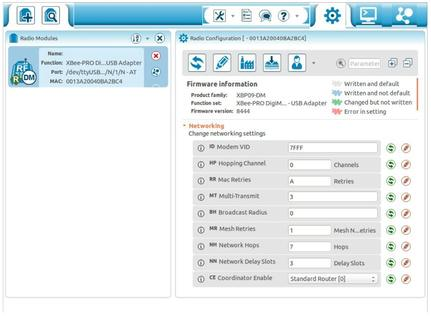

# XBee Pro DigiMesh 900
XBee-PRO 900 DigiMesh is useful for setting up your own low bandwidth mesh network. These adapters are great for Mesh Networks and implementations of networks such as VANETs. This tutorial is intended to help you with configuring these adapters and writing a simple python script to initiate bi-directional communication on a serial device.

## Configuring the Modules:

> IMPORTANT: The latest versions of X-CTU support Linux so don't follow the older guides found online which require 'wine' installation on Linux to run it.

Firstly, download and install X-CTU. [The official guide from DIGI](https://docs.digi.com/display/XCTU/Download+and+install+XCTU) will walk you through this process.

Once you are done with this, plug in your XBee adapter and launch X-CTU. The device should get detected automatically and you'll be presented with a screen similar to the one seen below.


Now it is important to note that this is not an ordinary XBee adapter which is why you'll see many more options than usual. Firstly, all your devices should be have same Modem VID (ID) and Hopping Channel (HP) for them to communicate. Now, further settings will depend on your individual requirements but just to explain some important parameters:
- **Multi-Transmit (MT):** To set/read number of additional broadcast re-transmissions. All broadcast packets are transmitted MT+1 times to ensure it is received.
- **Broadcast Radius (BR):** To set/read the transmission radius for broadcast data transmissions. Set to 0 for maximum radius. If BR is set greater than Network Hops then the value of Network Hops is used.
- **Mesh Retries (MR):** To set/read maximum number of network packet delivery attempts. If MR is non-zero, packets sent will request a network acknowledgement, and can be resent up to MR times if no acknowledgements are received.

Once you are done configuring your XBee PRO adapter as per your mesh network configurations, you are now ready to start using them.

## Using Python for Serial Communication
To carry out serial communication using Python, first we need to install pySerial.
Skip to Step 2 if you already have pip installed.
1. `sudo apt-get install python-pip`
2. `sudo pip install pyserial`

Now, to have bi-directional or full duplex communication, we'll have to use threads which ensure that read and write can happen simultaneously.
Here is a small python script which does that:
```
import serial
from threading import Thread

ser = serial.Serial("/dev/ttyUSB0", 9600, timeout=1)

def read_serial():
    while True:
        if ser.inWaiting() > 0:
            print ser.readline()

def write_serial():
    while True:
        x = input("Enter: ")
        ser.write(x)

t1 = Thread(target=read_serial)
t2 = Thread(target=write_serial)
t1.start()
t2.start()
```

To fix the issue of having to set the port manually every time or hard-coding it, you can add the lines below in your python script and then call the function connect, as provided below, to automatically detect the USB port. This will only work for one XBee adapter connected to the computer.
```
import subprocess

def connect():
    global ser, flag
    x = subprocess.check_output("ls /dev/serial/by-id", shell = True).split()
    if x[0].find("Digi") != -1:
        y = subprocess.check_output("dmesg | grep tty", shell = True).split()
        indices = [i for i, x in enumerate(y) if x == "FTDI"]
        address = "/dev/" + y[indices[-1]+8]
        ser = serial.Serial(address, 9600, timeout = 1)
        ser.flushInput()
        ser.flushOutput()
        flag = 0
    else:
        raise ValueError
```

Now you have configured the adapters and written a basic Python Script to carry out serial communication on a Mesh Network.

For advanced usage, look in to:
1. pySerial API: http://pyserial.readthedocs.org/en/latest/pyserial_api.html
 - This library has many more advanced functionalities to configure the port being used. The example code snippets provided on the website serve as a good starting point.
2. Threading API: https://docs.python.org/2/library/threading.html
- This library has many advanced functions to control the operation of a thread. One thing to look in particular is thread lock which is useful while operating on shared data structures between threads.

## Resources
1. To compare the DigiMesh architecture to ZigBee mesh architecture, you can refer to [this guide](http://www.digi.com/pdf/wp_zigbeevsdigimesh.pdf) which points out the pros and cons of both.
- For detailed information, please refer to the [User Guide](http://ftp1.digi.com/support/documentation/90000903_G.pdf). The guide has details regarding technical specifications, internal and overall communication architecture, command reference tables, etc.
