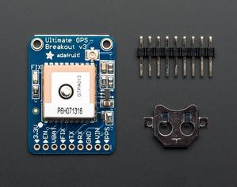
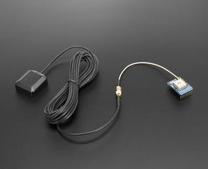

# Adafruit GPS
 

The Adafruit Ultimate GPS module is designed for convenient use with Arduino, Raspberry Pi, or other commonly used micro-controllers. The breakout is built around the MTK3339 chipset, a no-nonsense, high-quality GPS module that can track up to 22 satellites on 66 channels, has an excellent high-sensitivity receiver (-165 dB tracking), and a built-in antenna!

The GPS module can do up to 10 location updates per second for high speed, high sensitivity logging or tracking. Power usage is incredibly low, only 20 mA during navigation. It includes an ultra-low dropout 3.3V regulator so you can power it with 3.3-5VDC inputs, ENABLE pin so you can turn off the module using any microcontroller pin or switch, a footprint for optional CR1220 coin cell to keep the RTC running and allow warm starts and a tiny bright red LED. The LED blinks at about 1Hz while it's searching for satellites and blinks once every 15 seconds when a fix is found to conserve power.

Two features that really stand out about this version 3 MTK3339-based module is the external antenna functionality and the the built in data-logging capability. The module has a standard ceramic patch antenna that gives it -165 dB sensitivity, but when you want to have a bigger antenna, you can easily add one. The off-the-shelf product can be easily purchased from either [Adafruit](https://www.adafruit.com/product/746) or [Amazon](https://www.amazon.com/Adafruit-Ultimate-GPS-Breakout-channel/dp/B00GLW4016/ref=sr_1_1?ie=UTF8&qid=1495048345&sr=8-1-spons&keywords=adafruit+ultimate+gps+breakout&psc=1), and it comes with one fully assembled and tested module, a piece of header you can solder to it for bread-boarding, and a CR1220 coin cell holder.

A summary of all technical details mentioned above is as the following:
 - Satellites: 22 tracking, 66 searching
 - Patch Antenna Size: 15mm x 15mm x 4mm
 - Update rate: 1 to 10 Hz
 - Position Accuracy: < 3 meters (all GPS technology has about 3m accuracy)
 - Velocity Accuracy: 0.1 meters/s
 - Warm/cold start: 34 seconds
 - Acquisition sensitivity: -145 dBm
 - Tracking sensitivity: -165 dBm
 - Maximum Velocity: 515m/s
 - Vin range: 3.0-5.5VDC
 - MTK3339 Operating current: 25mA tracking, 20 mA current draw during navigation
 - Output: NMEA 0183, 9600 baud default
 - DGPS/WAAS/EGNOS supported
 - FCC E911 compliance and AGPS support (Offline mode : EPO valid up to 14 days )
 - Up to 210 PRN channels
 - Jammer detection and reduction
 - Multi-path detection and compensation

Best of all, Adafruit has also provided [a detailed tutorial](https://learn.adafruit.com/adafruit-ultimate-gps/overview) on its website and an [Arduino library](https://github.com/adafruit/Adafruit_GPS) that "does a lot of the 'heavy lifting' required for receiving data from GPS modules, such as reading the streaming data in a background interrupt and auto-magically parsing it". Overall, the abundant resources available to the public allow users from all levels to fully take advantage of the powerful functionality that this GPS module can provide.

To use the GPS module on ROS, the [nmea_navsat_driver](http://wiki.ros.org/nmea_navsat_driver) is an excellent ROS package for obtaining fix position and velocity information efficiently from the sensor's raw output:

``$ rosrun nmea_navsat_driver nmea_serial_driver _port:=/dev/ttyACM0 _baud:=115200``
