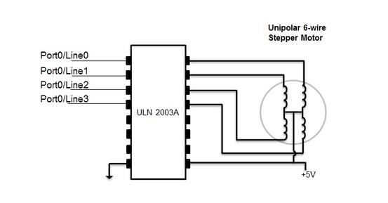

# Using ULN 2003A as a motor controller

## ULN 2003A - Darlington Array
ULN 2003A or otherwise known as Darlington array is a way to use signals from a microcontroller or any device that can only withstand low currents to control high current drawing devices such as relays, motors, bulbs etc.

ULN 2003A working is such that when input ports(1 to 7 on the left side) are given a "HIGH" input the corresponding output port on the right side goes "LOW". We can use this "LOW" state to ground the neutral of our device.

As can be seen in this diagram one of the leads of all of the coils of the motor are connected to a +5V and the other leads are all connected to the ULN2003A. In the normal state, the ULN2003A will have a "HIGH" on the output ports making the resultant potential difference across the coils ZERO. However, when one or more of the input pins turn "HIGH" the corresponding output pins turn "LOW" thus creating a potential difference across the coil and activating the coil. It must be noted here that the current going through the coil will ultimately go through the ULN2003A and hence the current capacity of ULN2003A limits the capacity of the device being connected. Each of the ports has a current limitation of 500mA and the voltage can go as high as 50V. However, if more current capacity is required then parallel connections can be made.

ULN2003A can thus be used as a low power motor controller, which is much more compact compared to traditional motor controllers. It can also be used to toggle relays, lights etc. By using this the current load on the microcontroller can be minimized. 
