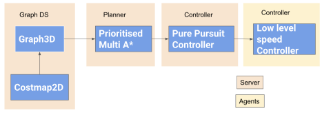
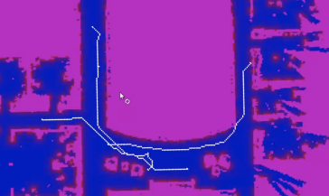
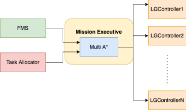

This article aims to present two competing approaches for multi robot navigation. There is a brief introduction on multi robot navigation followed by description, pros and cons of each of the two competing methods.

A multi robot navigation stack enables groups of robots to traverse around each other and navigate from their start positions to their goal locations without colliding with one another, crowding or slowing each other down. Usually the inputs to the stack are start and goal positions of each robot and some representation of the environment. Outputs of this stack are usually velocity commands that the robots can execute.

There are briefly two families of algorithms that are usually employed :
- Centralised 
- Decentalised

The choice for the above usually depends on the communication range and reliability. With good communication, a centalised method is usually more preferable and easier to get to work than a decentralised one. The scope of this article is restricted to the centralised family of algorithms.

Centralised family of algorithms can be further subdivided into two classes of approaches
- Planning based approach
- Control based approach

## Navigation Stack Design 1 : [Planning based approach](https://www.youtube.com/watch?v=K1_bagcw8Gc&themeRefresh=1)
In a planning based approach, we design and implement a centralised multi robot planner which calculates collision free trajectories for each robot in the fleet and then these are executed by each robot with a decentralised controller.



### Centralised Planner : [Prioritised Collaborative A*](https://github.com/MRSD-Team-RoboSAR/robosar_navigation)

As seen in the block diagram, most of the navigation stack runs on a centralised server apart from a low level speed controller running on the robot agents. We have a 3D Graph data structure which underneath uses a costmap to store the structure of the environment and provides a planning representation for our planner. The Planner uses this graph data structure to plan trajectories in x,y and time for each robot and then feeds these trajectories to a multi-threaded controller. The multi-threaded controller uses a classic pure pursuit formulation to generate command velocities to enable accurate tracking of the generated trajectories. The velocities are
then passed to the fleet management system which transmits them to the right agents for actual execution. 
At a high level the prioritized multi A* performs these steps in a loop to perform its task : 
- Assign priorities to the robot 
- for robots 1:n in order of priority 
	- Get start and goal for this robot 
	- Run A* graph search algorithm 
	- Treat previously planned robots as moving obstacles 
	- If path found, add this path to cache 
	- If path not found try again later after other robots 


The planner is built on top of a 3D graph which consists of nodes in x,y and time. The graph handles all the nearest neighbor searches, collision checks, distance queries and other utility functions for the planner. The graph uses a cost map of the environment to do its collision checks. The costmap inflates all the obstacles in the occupancy grid map and also assigns some cost to neutral motion to encourage planner to take the shortest paths. It also uses cached trajectories of other robots while doing the collision checks so that robots have collision free trajectories in time. The planner currently uses a manhattan distance heuristic to estimate the cost to goal. All set and map data structures are optimized using a custom 3D hash function and have an O(1) lookup time. Priorities are currently assigned to the robots arbitrary before planning and then planning is done sequentially. This is something that can be improved! An interesting finding is about relative cost of waiting in time as against moving. We found that if both moving as well as waiting have the same cost, then A* almost always prefer moving than waiting which can lead to suboptimal behavior. So as of now we have lower cost to waiting than moving which gives us better paths leads to increased search times which is undesirable. We found the paths to be very suboptimal in a 4 connected grid so we use an 8 connected grid which gives very good results but obviously also contributes to our increased search times. 



### Decentralised controller : [LGController](https://github.com/MRSD-Team-RoboSAR/robosar_controller)

Our trajectories in time include some pauses/stops along the way for avoiding collisions with other robots, so an off the shelf controller in 2D which ignores the time dimension was not going to work. So we came up with the LGController which borrows ideas from multiple different control schemes to help meet our requirements. Roughly the controller has the following components 

#### Preprocessing
- Reorient robot in the direction of the path upon entry 
- Go through the trajectory and push waypoints with a stop to a goal queue 
- Run a timer in the background to select waypoints along the trajectory 
- Create a 2D cartesian path from the 3D trajectory for pure pursuit 

#### During control 
- Compare waypoints with points in the goal queue and decide linear velocity 
- Use lookahead distance to find waypoint to track along the cartesian path 
- Use pure pursuit to generate angular corrections based on this waypoint 

We wrote a ROS action server to wrap this controller and use it with the rest of the subsystems. So during operation we have a LGController action server running per robot. So we can say that the planning is centralized but the control is completely decentralised. 



Once the planner and the controller were ready, there was a need to integrate them with the rest of the system. For this we wrote the Mission Executive class. Mission Executive does a lot of things during the operation. The first thing it is incharge of is asking the latest fleet information from the fleet management system and then setting up the controller servers for each robot in the fleet. It also listens for any changes in the fleet from the FMS and takes appropriate action based on it. It listens to tasks from the task allocation subsystem and is in charge of executing this mission. It first runs the planner on the tasks received from the task allocation. If planning was successful then the mission executive creates a ROS action client for each successful plan and then sends the planned trajectory to the appropriate controller server for execution. Then the mission executive also monitors the execution of the controller and gets ready for a new mission as soon as the controllers are done executing.

### Takeaways 

1. The Prioritised Multi A* as we know it does not guarantee completeness. Our naive heuristic also fails in very highly cluttered environments because instead of going around obstacles it can tend to wait around and hope for static obstacles to go away. So planning takes a long time. Some directions that can be considered for improving this :
	-  Use a Voronoi Graph instead of a densely connected 3D grid for planning 
	- Replace manhattan distance using a more realistic true distance heuristic function 
    - Use motion primitives with the planner instead of an 8 connected grid 
2. We found that without using the right motion primitives, robots deviate from the planned trajectories and then planning is wasted, so the planner should closely model kinematics of the robot, continous replanning at a fixed frequence could be used to alleiviate this problem
3. The controller that we implemented was a pretty basic proportional controller and it was unable to account for the execution errors
4. This Navigation stack design is appropriate for confined spaces when robots are large but operating area is narrow or robots are moving on a fixed grid, for our application we found this to not work as well as required


## Navigation Stack Design 2 : [Control based approach](https://www.youtube.com/watch?v=W_IN25bHFkQ)
In a control based approach, we plan for each robot in the fleet separately and local collision avoidance between the robot is done by a centralised controller.


### Decentralised Planner : [2D A* planner](https://github.com/MRSD-Team-RoboSAR/robosar_navigation)

### Centralised Controller : [Lazy Traffic Controller](https://github.com/MRSD-Team-RoboSAR/robosar_navigation)

### Basic syntax
A line in between create a separate paragraph. *This is italicized.* **This is bold.** Here is [a link](/). If you want to display the URL, you can do it like this <http://ri.cmu.edu/>.

> This is a note. Use it to reinforce important points, especially potential show stoppers for your readers. It is also appropriate to use for long quotes from other texts.


#### Bullet points and numbered lists
Here are some hints on writing (in no particular order):
- Focus on application knowledge.
  - Write tutorials to achieve a specific outcome.
  - Relay theory in an intuitive way (especially if you initially struggled).
    - It is likely that others are confused in the same way you were. They will benefit from your perspective.
  - You do not need to be an expert to produce useful content.
  - Document procedures as you learn them. You or others may refine them later.
- Use a professional tone.
  - Be non-partisan.
    - Characterize technology and practices in a way that assists the reader to make intelligent decisions.
    - When in doubt, use the SVOR (Strengths, Vulnerabilities, Opportunities, and Risks) framework.
  - Personal opinions have no place in the Wiki. Do not use "I." Only use "we" when referring to the contributors and editors of the Robotics Knowledgebase. You may "you" when giving instructions in tutorials.
- Use American English (for now).
  - We made add support for other languages in the future.
- The Robotics Knowledgebase is still evolving. We are using Jekyll and GitHub Pages in and a novel way and are always looking for contributors' input.

Entries in the Wiki should follow this format:
1. Excerpt introducing the entry's contents.
  - Be sure to specify if it is a tutorial or an article.
  - Remember that the first 100 words get used else where. A well written excerpt ensures that your entry gets read.
2. The content of your entry.
3. Summary.
4. See Also Links (relevant articles in the Wiki).
5. Further Reading (relevant articles on other sites).
6. References.

#### Code snippets
There's also a lot of support for displaying code. You can do it inline like `this`. You should also use the inline code syntax for `filenames` and `ROS_node_names`.

Larger chunks of code should use this format:
```
def recover_msg(msg):

        // Good coders comment their code for others.

        pw = ProtocolWrapper()

        // Explanation.

        if rec_crc != calc_crc:
            return None
```
This would be a good spot further explain you code snippet. Break it down for the user so they understand what is going on.

#### LaTex Math Support
Here is an example MathJax inline rendering $ \phi(x\|y) $ (note the additional escape for using \|), and here is a block rendering:
$$ \frac{1}{n^{2}} $$

#### Images and Video
Images and embedded video are supported.






The video id can be found at the end of the URL. In this case, the URLs were
`https://www.youtube.com/watch?v=8P9geWwi9e0`
& `https://vimeo.com/148982525`.

## Summary
Use this space to reinforce key points and to suggest next steps for your readers.

## See Also:
- Links to relevant material within the Robotics Knowledgebase go here.

## Further Reading
- Links to articles of interest outside the Wiki (that are not references) go here.

## References
- Links to References go here.
- References should be in alphabetical order.
- References should follow IEEE format.
- If you are referencing experimental results, include it in your published report and link to it here.
